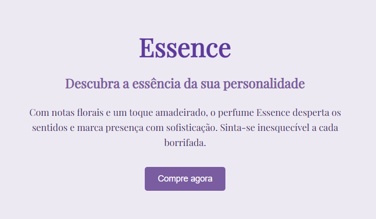

# 🎨 PSICOLOGIA DAS CORES EM SITES 🎨 
# Landing Page - Essence

Este projeto é uma landing page fictícia criada para a atividade #14 da disciplina **Tópicos Especiais**. A proposta da atividade é aplicar conceitos de HTML e CSS, utilizando uma **paleta de cores harmônica baseada no círculo cromático** e boas práticas de design responsivo e acessível.

## 🎯 Objetivos da Atividade

- Criar uma landing page simples com HTML e CSS externo.
- Utilizar uma paleta harmônica com base no círculo cromático (modelo **monocromático**).
- Aplicar estilos visuais coerentes, com bom contraste e tipografia legível.
- Incluir elementos essenciais de uma landing page: título, subtítulo, texto descritivo e botão de chamada para ação (CTA).

## 🧱 Estrutura do Projeto

- `index.html` → Estrutura da página.
- `style.css` → Estilos externos aplicados.
- `README.md` → Documentação do projeto.

## 🎨 Paleta de Cores (Monocromática - Roxo)

| Elemento           | Cor       | Código Hex |
|--------------------|-----------|------------|
| Fundo da página    | Lilás claro | `#EDE9F3`  |
| Título             | Roxo profundo | `#5D3A9B`  |
| Subtítulo          | Roxo médio | `#7A5CA0`  |
| Parágrafo          | Roxo escuro | `#4B3869`  |
| Botão (normal)     | Roxo médio | `#7A5CA0`  |
| Botão (hover)      | Roxo profundo | `#5D3A9B`  |

## 🔠 Tipografia

- Fonte utilizada: [Playfair Display](https://fonts.google.com/specimen/Playfair+Display) (Google Fonts)
- Estilo serifado, elegante e adequado à identidade visual do produto (perfume)

## 📸 Captura de Tela

