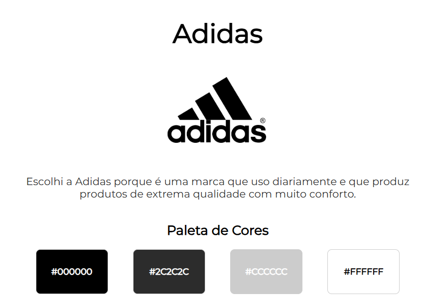

# 🎨 PSICOLOGIA DAS CORES EM SITES 🎨  
# Landing Page - Adidas

Este projeto é uma landing page simples criada para a atividade #15 da disciplina **Tópicos Especiais**. A proposta é desenvolver um site básico em HTML e CSS utilizando a **paleta de cores da marca Adidas**, extraída do seu logotipo através da ferramenta Adobe Color.

## 🎯 Objetivos da Atividade

- Escolher uma marca famosa e extrair sua paleta de cores.
- Criar uma landing page com estrutura HTML e estilização externa via CSS.
- Aplicar as cores extraídas de forma visualmente harmônica.
- Inserir o logo oficial da marca e uma apresentação pessoal da escolha.

## 🧱 Estrutura do Projeto

- `index.html` → Estrutura da página.
- `style.css` → Estilos externos aplicados.
- `README.md` → Documentação do projeto.

## 🎨 Paleta de Cores (Monocromática - Preto/Branco Adidas)

| Elemento        | Cor           | Código Hex |
|-----------------|----------------|------------|
| Fundo da página | Branco         | `#FFFFFF`  |
| Título          | Preto intenso  | `#000000`  |
| Texto principal | Cinza escuro   | `#2C2C2C`  |
| Paleta          | Cinza claro    | `#CCCCCC`  |

> Paleta extraída do logotipo original da Adidas via [Adobe Color](https://color.adobe.com/).

## 🔠 Tipografia

- Fonte utilizada: [Montserrat](https://fonts.google.com/specimen/Montserrat) (Google Fonts)  
- Fonte sem serifa moderna, clara e fácil de ler, combinando com a identidade da marca esportiva.

## 📸 Captura de Tela  

